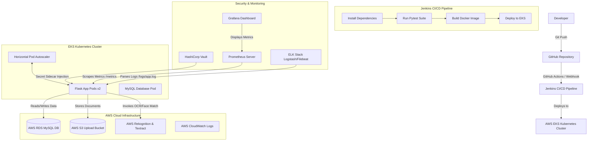

# Digital KYC Verification Platform — Comprehensive Project Documentation

This document contains the complete technical specification, system architecture, directory structures, setup instructions, and validation procedures for the **Digital KYC Verification Platform**.

---

## 1. Executive Summary & Architecture

The **Digital KYC Verification Platform** is an enterprise-grade, cloud-native DevOps solution designed for the FinTech industry to automate and secure customer onboarding. The core Flask application is backed by MySQL, containerized with Docker, automated using Jenkins and GitHub Actions, orchestrated with Kubernetes (utilizing HPA autoscaling), and provisioned on AWS (EKS, RDS, S3) using Terraform. It features robust logging (ELK Stack), metrics collection (Prometheus & Grafana), secrets management (HashiCorp Vault), and automated backup/restore scripts.

### End-to-End System Flow



---

## 2. Technology Stack Mapping

| Layer | Component | Description / Role in Project |
| :--- | :--- | :--- |
| **Frontend/Backend** | Python 3.11 / Flask | Web interface for customer onboarding, document uploads, and admin approval dashboard. |
| **Database** | MySQL 8.0 / SQLite | SQLite used for local mock environments; MySQL/RDS used for containerized and AWS production environments. |
| **Containerization** | Docker | Packages the application code, virtualenv, and Gunicorn WSGI server into a lightweight image. |
| **CI/CD Automation** | Jenkins & GitHub Actions | Jenkins handles local automated testing and deployments; GitHub Actions validates push/PR code. |
| **Orchestration** | Kubernetes (EKS) | Deploys Flask pods in a high-availability layout with Horizontal Pod Autoscaler (HPA). |
| **Infrastructure as Code** | Terraform | Declares VPC networks, subnets across multiple AZs, EKS node groups, RDS DB instances, S3, and IAM roles. |
| **Cloud Services** | AWS (EKS, RDS, S3, IAM, Rekognition, CloudWatch) | Cloud infrastructure host. AWS Rekognition & Textract perform OCR face matching. |
| **Observability** | Prometheus, Grafana, and ELK Stack | Prometheus scrapes metrics; Grafana visualizes load; Filebeat and Logstash harvest and ship logs. |
| **Security** | HashiCorp Vault | Stores secrets (database credentials and AWS API keys) and mounts them via sidecar containers. |
| **Disaster Recovery** | Shell Scripting | Scripts to backup DB records and uploads to S3, and restore them to clean environments. |

---

## 3. Directory Layout

The workspace is organized logically to separate the application source code from deployment configurations:

```
digital-kyc/
├── .github/
│   └── workflows/
│       └── ci.yml             # GitHub Actions Automated CI pipeline
├── disaster-recovery/
│   ├── backup.sh              # Automated database & S3 upload backup script
│   └── restore.sh             # Restoration script pulling backups from S3
├── k8s/
│   ├── database.yaml          # Consolidates K8s Secrets, PV, PVC, MySQL Deployment & Service
│   ├── deployment.yaml        # Flask app Deployment manifest & HorizontalPodAutoscaler (HPA)
│   └── service.yaml           # External NodePort Service config for public routing
├── logging/
│   ├── filebeat.yaml          # Filebeat daemon log harvesting configuration
│   └── logstash.conf          # Logstash pipeline grok parser and elasticsearch shipper
├── monitoring/
│   ├── grafana-dashboard.json # Pre-configured dashboard template for Grafana
│   └── prometheus.yml         # Prometheus scraper polling targets and metrics paths
├── security/
│   ├── vault-agent-config.yaml# Kubernetes EKS sidecar secret injection template
│   └── vault-config.hcl       # HashiCorp Vault server storage & API config
├── static/
│   ├── bootstrap.min.css      # Styling layout library
│   └── style.css              # Custom UI CSS styles
├── templates/
│   ├── base.html              # HTML core shell template
│   ├── register.html          # Registration form page
│   ├── login.html             # User login page
│   ├── dashboard.html         # Customer document upload and status view
│   └── admin_dashboard.html   # Admin review and verification status screen
├── terraform/
│   ├── main.tf                # AWS networking, EKS cluster, Node Groups, RDS, S3, and IAM config
│   ├── variables.tf           # Configurable variables for region, instance sizes, and credentials
│   └── outputs.tf             # Key resources outputs (EKS cluster names, RDS hostnames, S3 bucket)
├── tests/
│   └── test_app.py            # Pytest test suite covering endpoints, DB CRUD, and OCR simulation
├── Dockerfile                 # Multi-stage production container configuration
├── Jenkinsfile                # CI/CD pipeline automation (Build, Test, Package, Deploy)
├── requirements.txt           # Python package requirements
├── app.py                     # Main Flask Application
└── README.md                  # Quick start instructions
```

---

## 4. Phase-by-Phase Setup Instructions

### Phase 1: Run the Flask Web Application Locally (Development Mode)

1. **Create and Activate Virtual Environment**:
   ```bash
   python3 -m venv venv
   source venv/bin/activate
   ```
2. **Install Dependencies**:
   ```bash
   pip install -r requirements.txt
   ```
3. **Execute the Flask App**:
   ```bash
   python app.py
   ```
   * *Note*: Because no database environment variables are set, the app dynamically constructs and initializes a local `sqlite:///kyc.db` file.
   * Open `http://127.0.0.1:5000` in your web browser. Default credentials are `admin` / `admin123`.

---

### Phase 2: Run Pytest Unit Tests

To run the automated tests locally:
```bash
pip install pytest
PYTHONPATH=. pytest tests/ -v
```
This tests home redirection, `/health` JSON integrity, mock OCR simulations, user registration, and login database insertions.

---

### Phase 3: Containerize with Docker

1. **Build the Container Image**:
   ```bash
   docker build -t digital-kyc:latest .
   ```
2. **Run the Single Container**:
   ```bash
   docker run -p 5000:5000 --name kyc-app -d digital-kyc:latest
   ```
   Check runtime logs with `docker logs kyc-app`.

---

### Phase 4: Kubernetes Local Deployment (Minikube)

1. **Start Minikube and Share Docker Daemon**:
   ```bash
   minikube start
   eval $(minikube docker-env)
   ```
2. **Build the Image Inside Minikube VM**:
   ```bash
   docker build -t digital-kyc:latest .
   ```
3. **Apply Deployments**:
   ```bash
   kubectl apply -f k8s/database.yaml
   kubectl apply -f k8s/deployment.yaml
   kubectl apply -f k8s/service.yaml
   ```
4. **Get Deployment Status & Expose App**:
   ```bash
   kubectl get pods -w
   kubectl get svc
   minikube service kyc-flask-service --url
   ```

---

### Phase 5: Infrastructure Provisioning with Terraform

Deploy the full AWS environment:
1. **Initialize Terraform & View Plan**:
   ```bash
   cd terraform
   terraform init
   terraform plan
   ```
2. **Apply Changes**:
   ```bash
   terraform apply --auto-approve
   ```
3. **Clean Up AWS Resources**:
   ```bash
   terraform destroy --auto-approve
   ```

---

### Phase 6: Disaster Recovery Backup & Restore

Backup the local or containerized database and files:
1. **Trigger Backup**:
   ```bash
   export DB_HOST="127.0.0.1"
   export DB_USER="kyc_user"
   export DB_PASS="kyc_pass"
   export DB_NAME="kyc_db"
   export S3_BUCKET_NAME="my-s3-backup-bucket"
   ./disaster-recovery/backup.sh
   ```
2. **Perform Recovery**:
   ```bash
   ./disaster-recovery/restore.sh <BACKUP_TIMESTAMP>
   ```

---

## 5. Security Model (Vault & IAM)

* **Secret Isolation**: In local and standard deployments, base64-encoded Kubernetes secrets inject parameters (`k8s/database.yaml`). 
* **HashiCorp Vault Integration**: In a production environment, EKS utilizes the Vault Agent Sidecar Injector (`security/vault-agent-config.yaml`). Pods utilize a Kubernetes ServiceAccount token to authenticate against Vault. Vault dynamically injects credentials directly into the container's virtual directory `/vault/secrets/config`, meaning no sensitive credentials are saved in environment variables or configuration files.
* **IAM Least Privilege Policy**: EKS pods communicate with AWS Rekognition and S3 using role-based trust relationships (IRSA). Workers possess access permissions constrained to OCR processing APIs (`rekognition:*` and `textract:*`) and the specific document S3 bucket.

---

## 6. Observability (Prometheus & ELK Stack)

* **Prometheus scraping**: The Flask application exposes standard metrics on `/metrics`. Prometheus queries this port every 15 seconds to track endpoint latency and request success/failure counts.
* **Grafana Dashboards**: The pre-defined JSON schema `monitoring/grafana-dashboard.json` visualizes these scraped metrics.
* **ELK Log Pipeline**: 
  1. Filebeat monitors `/app/logs/app.log`.
  2. Multi-line error exceptions are collected and forwarded to Logstash on port 5044.
  3. Logstash parses the messages using a Grok filter (`%{TIMESTAMP_ISO8601} %{LOGLEVEL} %{WORD:logger} %{GREEDYDATA:message}`) and routes the structured JSON index directly into Elasticsearch.
