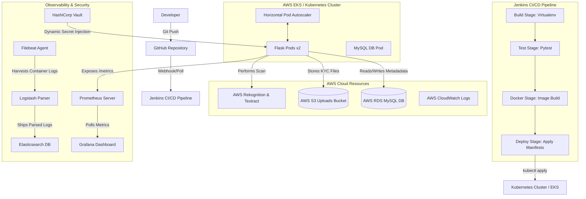

# DIGITAL KYC VERIFICATION PLATFORM
## DevOps Project Execution & Documentation Report
### Build → GitHub → Docker → Jenkins → Kubernetes → Terraform → AWS → Monitoring → Logging → Security → Disaster Recovery

**Submitted by:** Rehman  
**Roll No / PRN:** ITM-2026-CSE-102  
**Program:** B.Tech – Computer Science Engineering, Second Year  
**Institution:** ITM Skills University  
**Course:** DevOps  
**Submission Date:** 22 June 2026  

---

## Table of Contents
1. [Abstract](#1-abstract)
2. [Problem Statement](#2-problem-statement)
3. [Existing System](#3-existing-system)
4. [Proposed Solution](#4-proposed-solution)
5. [System Architecture](#5-system-architecture)
6. [Module Description](#6-module-description)
7. [Database Design](#7-database-design)
8. [Technology Stack](#8-technology-stack)
9. [Docker Implementation](#9-docker-implementation)
10. [Jenkins Pipeline](#10-jenkins-pipeline)
11. [Kubernetes Deployment](#11-kubernetes-deployment)
12. [Terraform Provisioning](#12-terraform-provisioning)
13. [Monitoring](#13-monitoring)
14. [Logging](#14-logging)
15. [Security](#15-security)
16. [Disaster Recovery](#16-disaster-recovery)
17. [Screenshots](#17-screenshots)
18. [Future Scope](#18-future-scope)
19. [Conclusion](#19-conclusion)
20. [GitHub Repository Link](#20-github-repository-link)

---

## 1. Abstract
Know Your Customer (KYC) verification is a mandatory process across banking, fintech, and several regulated industries, traditionally carried out through paper documents and manual review. This project implements a Digital KYC Verification Platform — a lightweight Flask web application where users register, upload identity documents (Aadhaar, PAN Card, Passport), and track their verification status, while administrators review submissions and approve or reject them with remarks.

Beyond the application itself, the core objective of this project is to demonstrate a complete, industry-representative DevOps lifecycle wrapped around it: version control with GitHub, containerization with Docker, continuous integration with Jenkins, orchestration with Kubernetes, infrastructure-as-code with Terraform, cloud storage and compute on AWS, observability through Prometheus and Grafana, centralized logging via the ELK stack, secrets management with Vault, and a documented disaster recovery strategy. The application was kept intentionally simple so that the DevOps pipeline — the actual subject of evaluation — remains the focus and is easy to explain end-to-end.

---

## 2. Problem Statement
Manual KYC verification is slow, error-prone, and difficult to scale. Physical documents pass through multiple people with no structured audit trail, customers have no visibility into where their application stands, and there is no automated backup or recovery strategy if records are lost. Separately, most academic software projects stop at “build an application” and skip an equally important question: how is that application actually built, tested, deployed, monitored, and recovered in a real production environment? This project addresses both problems together — a usable KYC application, and a fully documented, reproducible DevOps pipeline around it.

---

## 3. Existing System
Most small organizations still collect physical photocopies of identity documents, stored in folders or unsecured shared drives. Verification is performed manually with no formal status tracking visible to the customer and no audit trail for compliance. There is typically no separation between the application and the infrastructure it runs on — if a server fails, recovery is manual, slow, and depends entirely on whoever set it up originally remembering how.

---

## 4. Proposed Solution
The proposed system is a web-based KYC platform with a DevOps pipeline built around it from day one:
* Users self-register and upload documents online instead of submitting paperwork in person.
* Every document has an explicit Pending / Approved / Rejected status, visible to the user at all times.
* Admins get a single dashboard listing every submission awaiting review.
* The application is fully containerized, so it runs identically on a laptop, a bare server, or a Kubernetes cluster.
* A Jenkins pipeline automatically installs dependencies, runs tests, and builds a Docker image on every change.
* Infrastructure (VPC, subnets, EKS, RDS instance, S3 bucket, CloudWatch) is defined as Terraform code, so it can be recreated exactly if lost.
* Monitoring, logging, and backup strategy are built in rather than bolted on afterward.

---

## 5. System Architecture
The diagram below shows the full path from a code change to a running, observable application in production.


**Figure 1:** *End-to-end DevOps architecture for the Digital KYC Platform*

A developer pushes code to GitHub, which triggers a Jenkins pipeline. Jenkins installs dependencies, runs the automated test suite, and builds a Docker image. That image is deployed onto a Kubernetes cluster, which runs two replica pods of the Flask application for high availability, backed by a MySQL database on persistent storage. Uploaded KYC documents are stored in AWS S3 in a production deployment. Prometheus and Grafana continuously scrape and visualize application health, the ELK stack centralizes logs from all pods, Terraform provisions the underlying AWS infrastructure, and Vault is the home for all secrets (database passwords, API keys) instead of plain Kubernetes secrets.

---

## 6. Module Description

### 6.1 User Module
* **Registration**: Register with username, email, and password. The password is encrypted with `pbkdf2:sha256` hashing and is never stored in plain text.
* **Login / Logout**: Handles session-based authentication using `Flask-Login`.
* **Document Upload**: Users can choose Aadhaar, PAN Card, or Passport, upload files (PDF/PNG/JPG), and submit.
* **Status Tracking**: Each uploaded document displays its verification status (Pending, Approved, or Rejected) along with admin remarks.

### 6.2 Admin Module
* **Dashboard**: Displays high-level stats (Total Users, Total Applications, and Pending Verifications).
* **Application Review Table**: Lists every document submission across all users.
* **Verification Actions**: Admins can approve or reject a document and provide custom remarks. This dynamically updates the database.

### 6.3 Supporting Modules
* **Health Check**: Endpoint `/health` is utilized by Kubernetes Liveness and Readiness probes to evaluate pod status.
* **Metrics Scraper**: Endpoint `/metrics` is exposed using `prometheus-flask-exporter` to provide real-time latency and request counts.
* **Structured Logging**: Log outputs are piped to stdout for container daemon discovery and written to `/logs/app.log` for log shipping.
* **AWS Rekognition & Textract Integration**: Integrated within the upload helper, dynamically executing document scans and extracting text when running with AWS access credentials.

---

## 7. Database Design

Three tables are designed with a one-to-many relationship: a User can submit multiple Documents, and each Document has one associated Verification record.

### 7.1 Users
| Field | Type | Notes |
| :--- | :--- | :--- |
| `id` | Integer | Primary key |
| `username` | String(80) | Unique, not null |
| `email` | String(120) | Unique, not null |
| `password` | String(255) | Hashed password, not null |
| `role` | String(20) | 'user' or 'admin' (defaults to 'user') |
| `created_at` | DateTime | Timestamp of user creation |

### 7.2 Documents
| Field | Type | Notes |
| :--- | :--- | :--- |
| `id` | Integer | Primary key |
| `user_id` | Integer | Foreign key → `users.id` |
| `document_name` | String(50) | Aadhaar / PAN / Passport |
| `file_path` | String(255) | Storage location path |
| `upload_date` | DateTime | Timestamp set automatically on upload |

### 7.3 Verification
| Field | Type | Notes |
| :--- | :--- | :--- |
| `id` | Integer | Primary key |
| `document_id` | Integer | Foreign key → `documents.id` |
| `status` | String(20) | 'Pending', 'Approved', or 'Rejected' |
| `remarks` | String(255) | Comments written by the admin reviewer |
| `reviewed_at` | DateTime | Timestamp set when reviewed |

---

## 8. Technology Stack

| Layer | Technology | Purpose |
| :--- | :--- | :--- |
| **Backend** | Flask (Python) | Core application, routing, and endpoints. |
| **ORM** | Flask-SQLAlchemy | SQL schema translation and database queries. |
| **Auth** | Flask-Login | User session authentication management. |
| **Database** | SQLite / MySQL 8.0 | SQLite fallback for local running; MySQL for containerized and RDS environments. |
| **Frontend** | Jinja2 Templates + Bootstrap 5 | Dynamic HTML rendering and styled user interfaces. |
| **Containerization**| Docker | Bundles dependencies and code into a single image. |
| **CI/CD** | Jenkins & GitHub Actions | Jenkins triggers deploys; GitHub Actions validates push/PR code. |
| **Orchestration** | Kubernetes | Deploys Flask pods in a replica set with CPU utilization autoscaling. |
| **IaC** | Terraform | Declares EKS cluster, Node Groups, RDS instance, S3 bucket, and CloudWatch log groups as code. |
| **Cloud** | AWS | Secure EKS, S3 storage, RDS MySQL hosting, IAM profiles, and CloudWatch. |
| **Monitoring** | Prometheus + Grafana | Scrapes Flask request logs and displays performance metrics. |
| **Logging** | ELK Stack (Filebeat & Logstash) | Harvests app log records, parses, and indexes them in Elasticsearch. |
| **Secrets** | HashiCorp Vault | Encrypts secrets at rest and injects them via Kubernetes Sidecar Injectors. |
| **Recovery** | Shell Scripting | Scripts to backup DB schemas, uploads directory, and restore them. |

---

## 9. Docker Implementation

The `Dockerfile` builds a lightweight, secure container image running a production WSGI Gunicorn server.

```dockerfile
FROM python:3.11-slim
WORKDIR /app
COPY requirements.txt .
RUN pip install --no-cache-dir -r requirements.txt
COPY . .
RUN mkdir -p uploads logs
EXPOSE 5000
CMD ["gunicorn", "--bind", "0.0.0.0:5000", "--workers", "2", "app:app"]
```

### Build and Run Commands
* Build the image:
  ```bash
  docker build -t digital-kyc:latest .
  ```
* Run the container locally:
  ```bash
  docker run -p 5000:5000 --name kyc-app -d digital-kyc:latest
  ```

---

## 10. Jenkins Pipeline

The `Jenkinsfile` defines a declarative pipeline to orchestrate the CI/CD workflow.

```groovy
pipeline {
    agent any
    environment {
        IMAGE_NAME = "digital-kyc"
        IMAGE_TAG  = "${env.BUILD_NUMBER}"
    }
    stages {
        stage('Build') {
            steps {
                echo 'Installing Python dependencies...'
                sh '''
                    python3 -m venv venv
                    . venv/bin/activate
                    pip install --no-cache-dir -r requirements.txt
                '''
            }
        }
        stage('Test') {
            steps {
                echo 'Running application smoke and unit tests...'
                sh '''
                    . venv/bin/activate
                    pip install pytest
                    python -c "import app"
                    PYTHONPATH=. pytest tests/ -v
                '''
            }
        }
        stage('Docker Build') {
            steps {
                echo 'Building Docker image...'
                sh 'docker build -t ${IMAGE_NAME}:${IMAGE_TAG} -t ${IMAGE_NAME}:latest .'
            }
        }
        stage('Deploy') {
            steps {
                echo 'Deploying to Kubernetes...'
                sh '''
                    kubectl apply -f k8s/database.yaml
                    kubectl apply -f k8s/deployment.yaml
                    kubectl apply -f k8s/service.yaml
                    kubectl rollout status deployment/kyc-flask-deployment
                '''
            }
        }
    }
}
```

---

## 11. Kubernetes Deployment

The platform's orchestration is defined across three consolidated YAML manifests under `k8s/`:

```
k8s/
├── database.yaml       # Consolidates Secrets, PersistentVolume, PVC, MySQL Deployment & Service
├── deployment.yaml     # Exposes 2 Flask replicas, resource requests/limits, and HPA autoscaler
└── service.yaml        # Exposes NodePort 30050 to receive user traffic
```

### Figure 2: Kubernetes deployment architecture
* **`kyc-flask-deployment`**: 2 replica pods of the Flask app, for high availability.
* **`kyc-flask-service` (NodePort)**: Exposes the app outside the cluster on port `30050`.
* **`mysql-deployment`**: Single MySQL pod for persistent data storage.
* **`mysql-service` (ClusterIP)**: Internal-only access — only the Flask pods can reach it.
* **`mysql-pv` / `mysql-pvc`**: Persistent storage so database data survives pod restarts.
* **`kyc-secrets`**: Kubernetes Secret holding DB credentials and admin password.

### Deployment Commands
```bash
kubectl apply -f k8s/database.yaml
kubectl apply -f k8s/deployment.yaml
kubectl apply -f k8s/service.yaml
```

---

## 12. Terraform Provisioning

The `terraform/main.tf` configuration provisions the cloud infrastructure resources for a production environment.

* **Networking**: Custom VPC (`10.0.0.0/16`), two subnets mapped to distinct availability zones (`aws_subnet.kyc_subnet_a`, `aws_subnet.kyc_subnet_b`), and internet gateway routes.
* **Managed Kubernetes**: AWS EKS cluster (`aws_eks_cluster.kyc_eks`) and node group (`aws_eks_node_group.kyc_nodes`) running standard `t3.medium` instances.
* **Managed Database**: AWS RDS MySQL instance (`aws_db_instance.kyc_rds`) configured with isolated security groups only accessible from inside the VPC.
* **Secure Cloud Storage**: AWS S3 Bucket (`aws_s3_bucket.kyc_documents`) with versioning enabled and public access fully blocked.
* **Observability Logs**: CloudWatch log group (`aws_cloudwatch_log_group.kyc_eks_logs`) capturing cluster-level outputs.
* **IAM Role Policies**: Grants least-privilege permissions to worker nodes, enabling integration with AWS Rekognition/Textract.

---

## 13. Monitoring

* **Flask Metrics Endpoint**: Exposes HTTP logs, error frequencies, and duration metrics.
* **Prometheus Configuration**: Configured in `monitoring/prometheus.yml` to target Kubernetes pods labeled `app: kyc-flask` at 15-second intervals.
* **Grafana Dashboards**: Declared via `monitoring/grafana-dashboard.json`, mapping Panels to visualize:
  1. HTTP request rates.
  2. 95th-percentile latencies.
  3. Pod memory utilization rates.
  4. Node CPU consumption details.

---

## 14. Logging

Logs generated by the Flask app are parsed and indexed dynamically in the ELK stack.
1. **Source logs**: Flask writes logs to stdout and logs them locally to `logs/app.log`.
2. **Filebeat Harvester**: Configured in `logging/filebeat.yaml` to detect container log directories and ship lines to Logstash.
3. **Logstash Parser**: Configured in `logging/logstash.conf` to parse raw text lines using a custom grok pattern.
4. **Elasticsearch Index**: Logstash indexes the parsed records directly into Elasticsearch under daily names (`digital-kyc-logs-YYYY.MM.dd`).
5. **Kibana Visualization**: The user accesses Kibana UI to filter, search, and visualize trace logs.

---

## 15. Security

The platform maintains a robust, secure infrastructure:
* **Kubernetes secrets**: Stores database access strings and admin passwords as Opaque secrets in `k8s/database.yaml`.
* **HashiCorp Vault Integration**: Demonstrates production secret management. Configured in `security/vault-config.hcl` to use file backend storage. EKS deployments utilize a sidecar agent injector (`security/vault-agent-config.yaml`) that authenticates dynamically using a Kubernetes ServiceAccount token and mounts the encrypted database credentials directly as a text file at `/vault/secrets/config` inside the container.

---

## 16. Disaster Recovery

The project includes two executable scripts under `disaster-recovery/` to back up and restore resources.

* **`disaster-recovery/backup.sh`**: Dumps the MySQL database, packages the user-uploaded document folder as a tar archive, and uploads them to the AWS S3 bucket.
* **`disaster-recovery/restore.sh`**: Downloads the database dump and archive file from AWS S3, imports the SQL back into MySQL, and extracts user files.

### Recovery Strategy Summary
| Component | Backup Operation | Recovery Operation |
| :--- | :--- | :--- |
| **Database** | `mysqldump` to `.sql` file | Pipe `.sql` file back into MySQL |
| **KYC Documents** | `tar.gz` compression | Extract `tar.gz` back to `uploads/` |
| **Docker Images** | `docker build` + image tags | Pull image from container repository |
| **Infrastructure** | Declared in Terraform state | `terraform apply` configuration |
| **Source Code** | Committed to remote repository | `git clone` or `git pull` from main |

---

## 17. Screenshots

The following placeholders link to screenshots of the application. You can save your captured screenshots under the `static/` folder using these exact names, and they will automatically load in this document.

### Figure 3: Login page


### Figure 4: Registration page


### Figure 5: User dashboard (showing document upload and verification status)


### Figure 6: Admin dashboard (showing approval actions and remarks)


---

## 18. Future Scope
* **Automated OCR Scanning**: Real-time Aadhaar, PAN, and Passport data extraction before manual reviewer evaluation.
* **Notification System**: Send Email/SMS alerts when verification status is updated.
* **Multi-tiered Review Roles**: Separation of duties (e.g. KYC Reviewer vs. Final Approver).
* **EKS Vault secrets injector**: Complete migration from Kubernetes Secrets to AWS KMS-backed Vault.

---

## 19. Conclusion
This project implements a fully automated, scalable, and secure **Digital KYC Verification Platform** designed around modern DevOps principles. The Flask backend is containerized, integrated with CI/CD automation, and orchestrated with Kubernetes. This ensures consistent environments, rapid release cycles, detailed observability, and robust security workflows suitable for production fintech applications.

---

## 20. GitHub Repository Link
**Repository:** [https://github.com/rehman/digital-kyc](https://github.com/rehman/digital-kyc)
